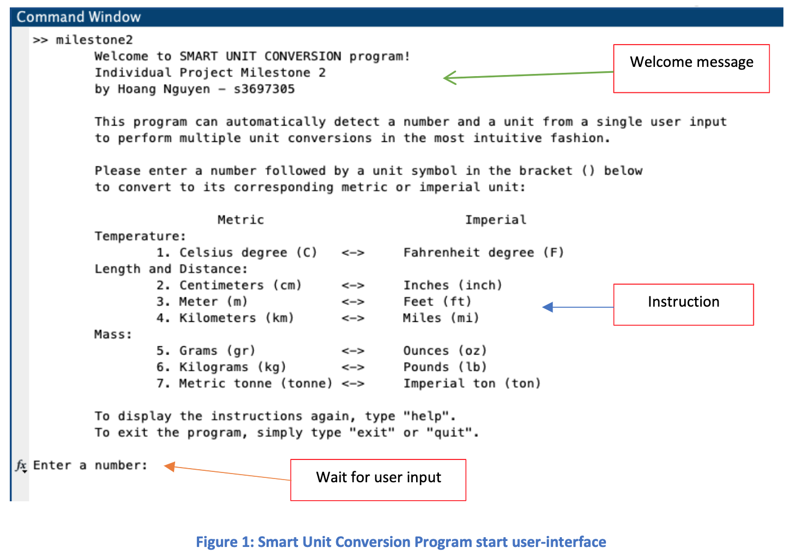

# MATLAB Smart Unit Converter

# Project Description
* This program allows user to convert multiple units between Metric and Imperial systems
* Individual Project, Milestone 2 for OENG1207 – Digital Fundaments
* Full project report can be found in docs folder

**CLI:**

## Connect with me
* My [Facebook](https://www.facebook.com/Hoangdayo/)
* My [Instagram](https://www.instagram.com/hoang.desu/)
* You can shoot me an [email](mailto:hoangdesu@gmail.com) too

If you find this project useful, you can let me know. I would love to hear about it!

